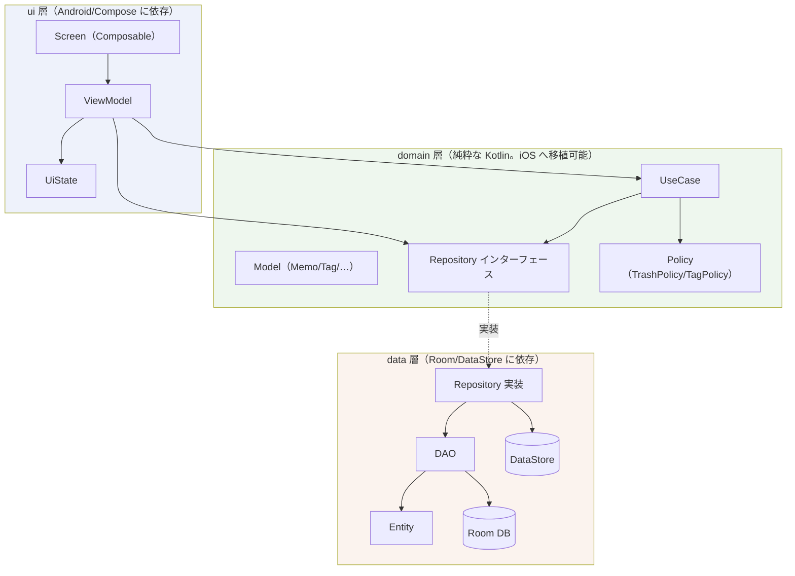
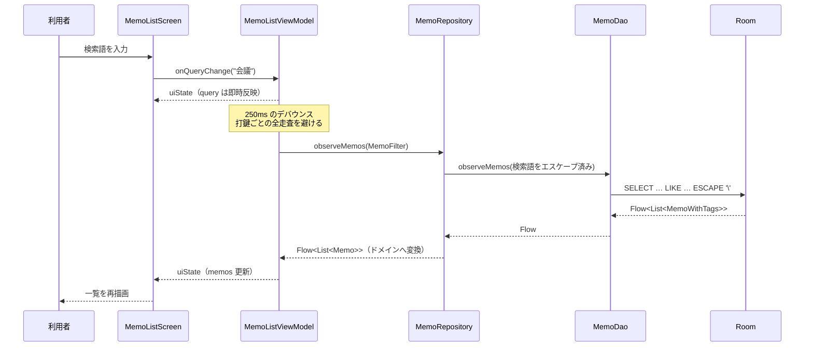
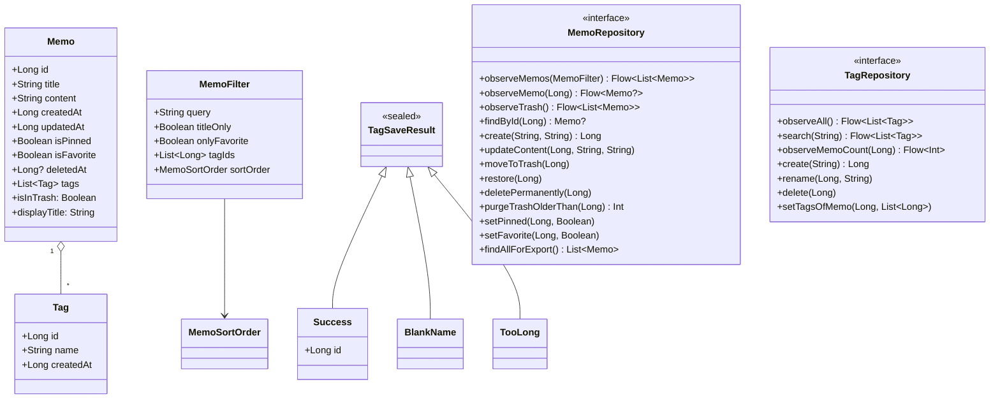
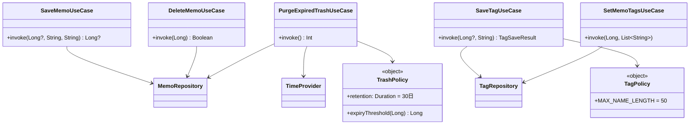
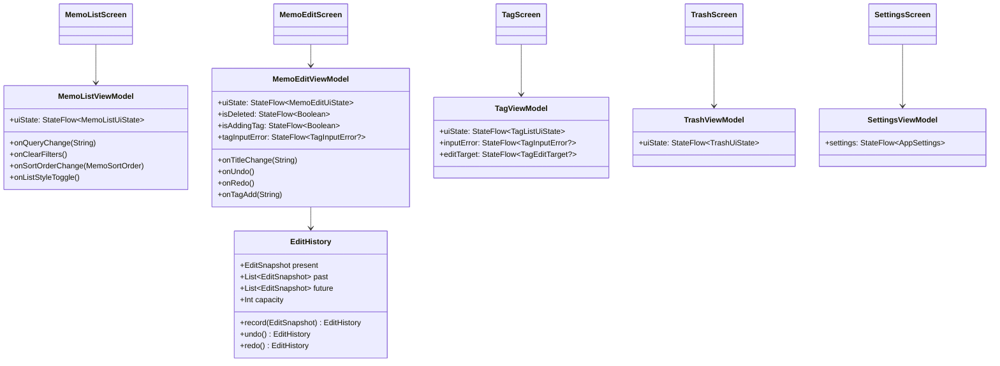
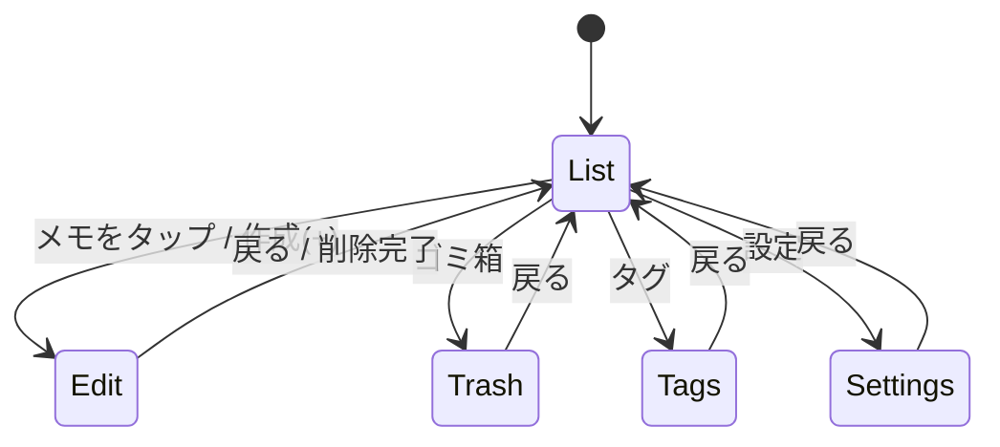

# アーキテクチャ

MVVM + Clean Architecture + Repository パターン。依存の向きは `ui → domain → data` の一方向のみで、逆流させない。

## 層の構成



`ui` と `data` は互いを知らない。両者は `domain` の Repository インターフェースだけで繋がり、実体の差し替えは Hilt が行う。

### 各層の責務

| 層 | 責務 | 依存してよいもの |
|---|---|---|
| `ui` | 状態の表示と入力の受け取り。表示用の文言もここが決める | `domain` |
| `domain` | 業務ルール。「30日で消える」「タグは50文字まで」などの判断 | なし（純粋な Kotlin） |
| `data` | 永続化。SQL と DataStore への読み書きに徹する | `domain`（インターフェースの実装として） |

`domain` を Android に依存させないのは、将来 iOS へ移植する際にこの層をそのまま持ち出せるようにするため。時刻を `Long`（epoch millis）で持つのも同じ理由。

### ディレクトリ

```
app/src/main/java/com/sapcework/memo/
  data/
    database/   MemoDatabase, Migrations
    dao/        MemoDao, TagDao, MemoSortKey
    entity/     MemoEntity, TagEntity, MemoTagCrossRef, MemoWithTags
    repository/ MemoRepositoryImpl, TagRepositoryImpl, SettingsRepositoryImpl, Mappers
  domain/
    model/      Memo, Tag, MemoFilter, MemoSortOrder, AppSettings, TrashPolicy, TagPolicy, TagSaveResult
    repository/ MemoRepository, TagRepository, SettingsRepository
    usecase/    SaveMemoUseCase, DeleteMemoUseCase, SetMemoTagsUseCase, SaveTagUseCase, PurgeExpiredTrashUseCase
  ui/
    screen/     list, edit, tag, trash, settings（各 Screen + ViewModel + UiState）
    component/  MemoCard, EmptyState, TagChip, TagInputDialog
    navigation/ MemoNavHost, MemoDestination
    theme/      Theme, Color, Type, Spacing, ContentWidth
  di/           CoreModule, DatabaseModule, DataStoreModule, RepositoryModule, IoDispatcher
  util/         DateFormat, EditHistory, TimeProvider, SqlLikeEscape
```

## データの流れ

一覧の検索を例に、入力が画面へ戻るまで。



入力そのものは待たせず、DB への問い合わせだけを遅らせる。10,000件規模で打鍵ごとに全走査すると実用に耐えないため。

## 依存性注入（Hilt）

すべて `SingletonComponent` に属する。

| モジュール | 提供するもの |
|---|---|
| `DatabaseModule` | `MemoDatabase`（Singleton）、`MemoDao`、`TagDao` |
| `DataStoreModule` | `DataStore<Preferences>`（Singleton） |
| `RepositoryModule` | Repository インターフェース → 実装の束縛（`@Binds`） |
| `CoreModule` | `TimeProvider`、IO用 `CoroutineDispatcher` |

`TimeProvider` を抽象化しているのは、ゴミ箱の30日パージのような時刻依存の処理をテストで固定するため。`System.currentTimeMillis()` を直接呼ぶと検証できない。

## クラス図

### domain 層



### UseCase と依存



UseCase を置くのは、UI に書くと画面ごとに再実装されて食い違う判断だけ。単なる委譲しかしない操作（ピン留めの切り替えなど）は ViewModel から Repository を直接呼ぶ。

- `SaveMemoUseCase` — 新規作成と更新の分岐。UI に置くと「新規のはずが二重に作成される」が起きる
- `DeleteMemoUseCase` — ゴミ箱へ移すか完全削除するかの判断。復元可能性が要件の中核
- `SaveTagUseCase` — タグ名の検証。作成画面と編集画面で別々に書くと片方だけ緩くなる
- `SetMemoTagsUseCase` — 名前から ID の解決と重複排除。表記ゆれのタグが増えるのを防ぐ
- `PurgeExpiredTrashUseCase` — 保持期間30日の適用。業務ルールなので data 層には置かない

### 画面と ViewModel



一覧系の `uiState` は `stateIn(WhileSubscribed)` で公開する。画面が見ていない間は DB の購読を止め、画面回転などの短い購読断では切らないよう猶予を置く（`ui/UiStateSharing.kt`）。

## 画面遷移



経路は `MemoDestination` に集約する。`Edit` は `edit/{memoId}` を取り、新規作成は番兵値 `-1`（`MemoEditViewModel.NEW_MEMO_ID`）で表す。Navigation の引数は null を扱いにくいため。

削除の完了は ViewModel が `isDeleted` で知らせ、画面を閉じる判断は画面側が持つ。ViewModel が遷移を指示すると、画面の都合が ViewModel へ漏れる。

## 関連ドキュメント

- [DB設計](database.md)
- [Repository仕様](repository-api.md)
- [テスト仕様](testing.md)
