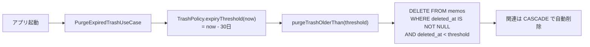

# DB設計

Room Database。端末内にのみ保存し、外部へ送信しない。

現在のバージョンは **1**。スキーマの実体は `app/schemas/com.sapcework.memo.data.database.MemoDatabase/1.json` に出力される（本書はそこから起こしたもの）。

## ER図

```mermaid
erDiagram
    memos ||--o{ memo_tag_cross_ref : ""
    tags ||--o{ memo_tag_cross_ref : ""

    memos {
        INTEGER id PK "autoGenerate"
        TEXT title "NOT NULL"
        TEXT content "NOT NULL"
        INTEGER created_at "NOT NULL"
        INTEGER updated_at "NOT NULL"
        INTEGER is_pinned "NOT NULL DEFAULT 0"
        INTEGER is_favorite "NOT NULL DEFAULT 0"
        INTEGER deleted_at "NULL可。非NULLならゴミ箱"
    }

    tags {
        INTEGER id PK "autoGenerate"
        TEXT name "NOT NULL / UNIQUE"
        INTEGER created_at "NOT NULL"
    }

    memo_tag_cross_ref {
        INTEGER memo_id PK-FK "→ memos.id / CASCADE"
        INTEGER tag_id PK-FK "→ tags.id / CASCADE"
    }
```

メモとタグは多対多。中間テーブルで表す。

## テーブル定義

### memos

メモ本体。

| 列 | 型 | 制約 | 説明 |
|---|---|---|---|
| `id` | INTEGER | PK, autoGenerate | |
| `title` | TEXT | NOT NULL | 空文字を許容する。空なら一覧では本文の先頭行を代わりに出す |
| `content` | TEXT | NOT NULL | 空文字を許容する |
| `created_at` | INTEGER | NOT NULL | epoch millis |
| `updated_at` | INTEGER | NOT NULL | epoch millis |
| `is_pinned` | INTEGER | NOT NULL, DEFAULT 0 | 真偽値 |
| `is_favorite` | INTEGER | NOT NULL, DEFAULT 0 | 真偽値 |
| `deleted_at` | INTEGER | NULL可 | ゴミ箱へ移した時刻。NULLなら通常のメモ |

**論理削除を採用する。** ゴミ箱は `deleted_at` が非NULLの行として表現し、物理削除は 30 日経過後のパージか、利用者による完全削除でのみ行う。「1回目は復元可能、2回目で完全削除」が要件の中核のため、削除＝行の消滅にはしない。

インデックス:

| 名前 | 列 | 目的 |
|---|---|---|
| `index_memos_deleted_at` | `deleted_at` | 一覧とゴミ箱の絞り込みに常時使う |
| `index_memos_updated_at` | `updated_at` | 並び替え（既定） |
| `index_memos_created_at` | `created_at` | 並び替え |
| `index_memos_is_pinned` | `is_pinned` | 並び替え（常に最優先） |
| `index_memos_is_favorite` | `is_favorite` | 絞り込みと並び替え |
| `index_memos_title` | `title` | 並び替え |

### tags

| 列 | 型 | 制約 | 説明 |
|---|---|---|---|
| `id` | INTEGER | PK, autoGenerate | |
| `name` | TEXT | NOT NULL, UNIQUE | |
| `created_at` | INTEGER | NOT NULL | epoch millis |

名前に UNIQUE 制約を張り、重複作成を DB レベルで防ぐ。アプリ側の検査だけに頼らない。長さの上限（50文字）は表示の都合であり DB 制約ではないため、`TagPolicy` が持つ。

### memo_tag_cross_ref

| 列 | 型 | 制約 |
|---|---|---|
| `memo_id` | INTEGER | PK（複合）, FK → `memos.id` ON DELETE CASCADE |
| `tag_id` | INTEGER | PK（複合）, FK → `tags.id` ON DELETE CASCADE |

外部キーに CASCADE を設定し、メモまたはタグの物理削除時に関連を自動で解消する。参照だけが残る不整合を DB レベルで防ぐ。両方向のインデックスを張り、結合を高速化する。

## 検索の方針

**全文検索に FTS を使わず LIKE で行う。** FTS4 が使えるトークナイザは空白・記号で単語を区切るため、分かち書きしない日本語では文全体が 1 トークンとなり部分一致が機能しない。10,000 件規模なら全走査でも実用的な速度に収まるため、速度より日本語での正しさを優先した。

検索語は必ず束縛パラメータで渡し、SQL へ文字列連結しない。加えて利用者の入力に含まれる `%` `_` `\` はワイルドカードとして働いてしまうため、Repository 層で `escapeLikeWildcards()` によりエスケープしてから DAO へ渡す（DAO 側のクエリは `ESCAPE '\'` を宣言している）。

> `ESCAPE '\'` は raw string（`"""`）で書くこと。通常の文字列リテラルでは `\'` がシングルクォートのエスケープと解釈され、SQL には `ESCAPE ''` が渡り実行時に必ず失敗する。

並び順も文字列連結で組み立てず、`MemoSortKey` の定数を束縛パラメータで渡して `CASE WHEN` で切り替える。

## パージ（保持期間）

「30日で消える」は業務ルールのため `TrashPolicy` が持ち、data 層には置かない。DAO は境界時刻を受け取って消すだけの永続化に徹する。



一覧画面の起動ごとに実行する。失敗しても一覧の表示は妨げない。

## Migration 方針

- `MemoDatabase.version` を上げ、対応する `Migration` を `Migrations.ALL` へ登録する
- **`fallbackToDestructiveMigration` は使用しない。** 利用者のメモを消すため
- スキーマ JSON は `app/schemas/` へ出力され、Migration テストの入力になる

現在は version 1 のみで移行元が存在しないため、Migration テストは未実装。v2 を切る際に追加する。

## 関連ドキュメント

- [アーキテクチャ](architecture.md)
- [Repository仕様](repository-api.md)
- [テスト仕様](testing.md)
